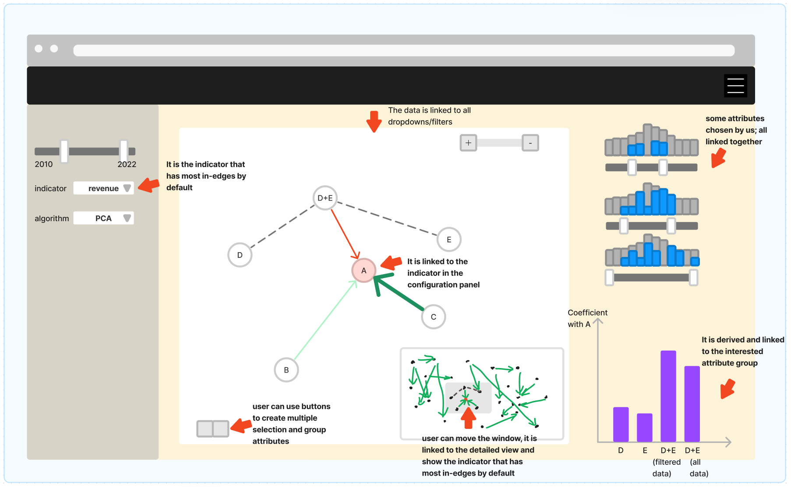

# IVDA_panda_ds2023

## Sketch

### 1. Configuration Panel
- Range slider for years
- Dropdown for selected indicators (the dependent variable)
    This element is **linked** to the network graph. Most connected indicator in the graph is selected by default.
- Dropdown for dimension-reduction algorithms

### 2. Histograms
-Interactive filters for some fixed attributes
    These histograms are **linked** to each other, with blue-highlighting area indicating the intersections.

### 3. Bar Chart

## Sketch
### To run frontend:
In frontend folder,
-  delete node_modules
-  run the following in terminal:
      npm install
      npm run serve
